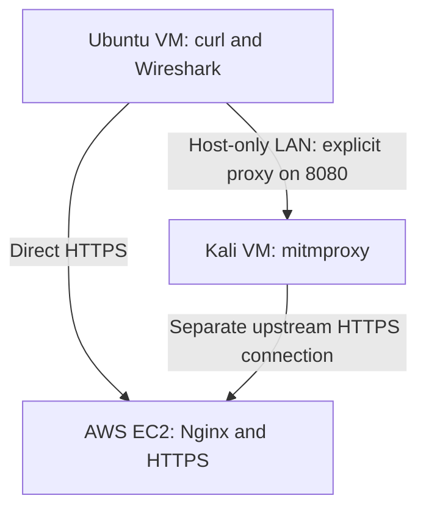

# HTTPS and Controlled Interception Lab

An owned AWS HTTPS endpoint, an Ubuntu client VM, and a Kali explicit proxy demonstrate how certificate trust affects HTTPS inspection. Wireshark records network traffic; mitmproxy displays decoded requests when the client deliberately trusts the proxy's certificate authority (CA).

## Topology



Both local VMs use NAT for internet access and a shared host-only network for the proxy connection. DuckDNS resolves the lab hostname to the AWS public address; it does not proxy the traffic.

## Environment

| Component | Lab setting |
| --- | --- |
| Client | Ubuntu Desktop VM; curl and Wireshark |
| Proxy | Kali VM; mitmproxy regular mode, TCP 8080 |
| Kali host-only address | `192.168.56.102` |
| Endpoint | Owned AWS EC2 endpoint using Nginx and a Let's Encrypt certificate |
| Hostname | `hypnos-https-lab.duckdns.org` |
| Test data | Fictional query marker: `DEMO_ONLY_123` |
| Trust | Public proxy CA certificate supplied through curl `--cacert` for one invocation |

Exact software versions and packet numbers are omitted because they are not available in the accompanying written record. See [observations](notes/observations.md) for evidence boundaries and [the project brief](breakdown.md) for the original setup procedure. The brief's example IPs and AMI version are instructions, not proof of the actual environment.

## Results and evidence

| Test | Result and meaning | Evidence |
| --- | --- | --- |
| Direct origin validation | HTTPS origin validation was documented using curl. | [Origin TLS](evidence/01-valid-origin-tls.png) |
| Direct packet capture | TLS handshake metadata can reveal the hostname, while request data travels encrypted. A hostname visible in Client Hello is different from the query marker. | [Direct capture](evidence/02-direct-tls-wireshark.png) |
| Proxy without CA trust | The untrusted proxy test documents certificate verification rejection. | [Untrusted proxy](evidence/03-untrusted-proxy-rejected.png) |
| Proxy with scoped trust | Matching CA fingerprints and HTTP 200 were reported. mitmproxy inspection documents the fictional request. | [Trusted flow](evidence/04-trusted-proxy-flow.png) |
| Proxy wire capture | The proxy connection is documented separately from the decoded mitmproxy flow. CONNECT identifies the destination; the subsequent client-to-proxy TLS protects the request on the wire. | [Proxy capture](evidence/05-proxy-wire-capture.png) |

These links require the original screenshots to be copied into `evidence/` using the exact filenames above. The downloadable documentation package does not include the screenshots.

## Reproduce the client and proxy tests

Use only an endpoint and VMs you own. Configure the HTTPS endpoint first using [breakdown.md](breakdown.md). Replace the cloud IP and Ubuntu host-only IP with your actual addresses. Do not disable certificate verification.

On Ubuntu:

```bash
LAB_DOMAIN=hypnos-https-lab.duckdns.org
KALI_IP=192.168.56.102
curl --noproxy '*' -Iv "https://$LAB_DOMAIN/"
curl --noproxy '*' --http1.1 -sS -o /dev/null -w '%{http_code}\n'   "https://$LAB_DOMAIN/?marker=DEMO_ONLY_123"
```

In Wireshark, select Ubuntu's NAT-facing interface and use the capture filter `tcp port 443 and host YOUR_EC2_PUBLIC_IP`. Start capture before the request and stop afterward. Inspect the handshake and application data. Use Find Packet with **Packet bytes**, **String**, and the exact marker `DEMO_ONLY_123`. Record the result; searching a differently spelled string is not equivalent.

On Kali:

```bash
mitmproxy --mode regular --listen-host 192.168.56.102 --listen-port 8080
```

On Ubuntu, test without trusting the lab CA:

```bash
curl --proxy "http://$KALI_IP:8080" --noproxy '' --http1.1 -Iv   "https://$LAB_DOMAIN/?marker=DEMO_ONLY_123"
```

Transfer only Kali's public `mitmproxy-ca-cert.pem` to `~/https-lab-private/` on Ubuntu over the isolated lab network. Compare its SHA-256 fingerprint on both VMs using `openssl x509 -in PATH_TO_CERT -noout -fingerprint -sha256`. Never transfer the CA private key.

Test with trust scoped to this invocation:

```bash
curl --proxy "http://$KALI_IP:8080" --noproxy ''   --cacert ~/https-lab-private/mitmproxy-ca-cert.pem --http1.1 -i   "https://$LAB_DOMAIN/?marker=DEMO_ONLY_123"
```

Inspect the request URL and response in mitmproxy. In Kali Wireshark, capture the host-only interface using `tcp port 8080 and host YOUR_UBUNTU_HOST_ONLY_IP`. Inspect CONNECT and the following TLS traffic; if needed, decode TCP 8080 as HTTP.

## Interpretation and limitations

This is controlled, explicit proxying with deliberate client trust. The proxy creates two TLS connections: Ubuntu-to-Kali and Kali-to-origin. Its ability to inspect the request follows from being a trusted endpoint for the first connection. This does not demonstrate breaking TLS, passive HTTPS decryption, transparent interception, or interception of an unsuspecting user. The marker-search result applies only to the captured traffic and search settings.

## Cleanup and publication

Stop mitmproxy and any temporary certificate-transfer server. Remove the downloaded lab CA when finished. Terminate unused EC2 resources and remove or repoint the DNS record, or document why the endpoint is retained. Cleanup completion has not been established in this record.

Keep raw captures, proxy flow dumps, credentials, private keys, and CA directories outside Git. The ignore rules provide a backstop; inspect staged files before every push. See [UPLOAD.md](UPLOAD.md) for upload commands.
