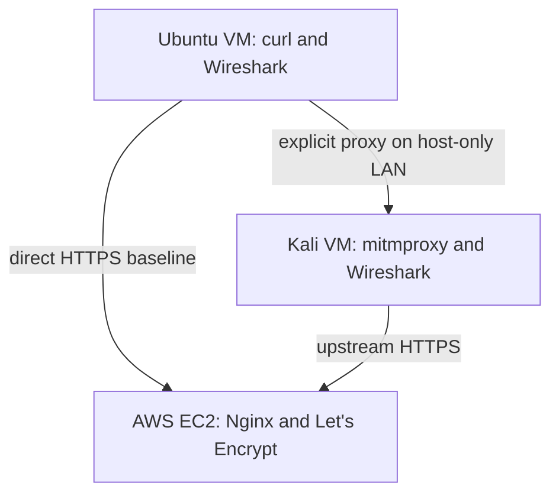

# Portfolio project: HTTPS and controlled interception

This project brief provides phased instructions for configuring the HTTPS endpoint, testing proxy certificate trust, capturing traffic, documenting evidence, and cleaning up the lab.

> Use this as a project brief in ChatGPT. Work through one phase at a time; ask for my actual outputs and screenshots before stating findings. Never invent packet numbers, certificate details, or test results. Troubleshoot each failure before moving on.

## Outcome

Host a harmless page on **your own small Ubuntu EC2 instance under the AWS Free account plan** with a **Let's Encrypt certificate**. From **local machine 1 (Ubuntu Desktop VM)** request the page directly and inspect TLS in Wireshark. Then route a request through **local machine 2 (Kali VM)**, running mitmproxy as an explicit proxy. Show that certificate verification rejects the proxy before trust is granted, and that the proxy reads the fictional request after you explicitly trust its lab CA for one curl command. Capture the encrypted connection to Kali in Wireshark.

**Honest interpretation:** Passive Wireshark does not reveal HTTPS request data. The proxy can inspect data because machine 1 deliberately routes traffic through it and trusts its CA. The cloud server presents its Let's Encrypt certificate on the Kali-to-cloud leg; Kali presents a separate lab certificate on the Ubuntu-to-Kali leg. This is not a demonstration of breaking TLS or intercepting an unsuspecting internet user.

**Time:** about two days once the VMs, cloud account, and DNS are ready. **Cost:** $0 out of pocket only if you are eligible for and deliberately select AWS's **Free account plan**, remain within its credits, and do not upgrade to the Paid plan. AWS currently states that this plan ends after six months or when its credits are exhausted and does not charge unless you upgrade. This is not an always-free EC2 promise. If the Free plan is not offered to your account, do not launch the instance. Let's Encrypt and an optional DuckDNS hostname are free. Use only your own VMs, cloud endpoint, and fictional marker. Do not run scans against cloud infrastructure or use real credentials/tokens in requests.

## Prerequisites and topology

- Ubuntu Desktop VM (machine 1) and Kali VM (machine 2), each with VirtualBox **Adapter 1: NAT** for internet and **Adapter 2: Host-only Adapter** on the same isolated LAN. Example host-only IPs: Ubuntu `192.168.56.11`, Kali `192.168.56.12`; use `ip -br addr` for the real values. If host-only networking is unavailable, an isolated internal network plus a NAT adapter on each VM works too. Allow Ubuntu to reach Kali TCP 8080.
- Your own small AWS EC2 **Ubuntu** instance created while the account is on the **Free account plan**, with a public IPv4 address and SSH key pair. Its security group and guest firewall must permit TCP 80 and 443. Restrict SSH/22 to your public IP. Keep proxy port 8080 off the internet.
- A hostname that resolves to the EC2 public IPv4. Either use a domain you control, such as `lab.example.net`, or create a free hostname such as `YOUR_SUBDOMAIN.duckdns.org`. Never publish or screenshot a DuckDNS account token. This workflow needs a usable hostname; do not substitute `curl -k`. Do not stop and restart EC2 during the lab unless you are prepared to update DNS when its public IPv4 changes.
- Install `curl`, `git`, `wireshark`, and `dnsutils` on Ubuntu; `mitmproxy`, `wireshark`, and `curl` on Kali. For Wireshark capture permissions, enable non-root capture during installation; if needed add your user to the `wireshark` group and log out/in.



Record the *actual* addresses in private notes. The example IPs are illustrative.

## Deliverable and publication rules

```text
https-interception-lab/
├── README.md
├── breakdown.md
├── .gitignore
├── site/index.html
├── notes/observations.md
└── evidence/
    ├── 01-valid-origin-tls.png
    ├── 02-direct-tls-wireshark.png
    ├── 03-untrusted-proxy-rejected.png
    ├── 04-trusted-proxy-flow.png
    └── 05-proxy-wire-capture.png
```

Keep `.pcapng` files and mitmproxy flow dumps **private by default**: they may contain unrelated traffic, metadata, or payloads. If you elect to publish one, collect a new narrow capture and inspect *every* packet first. Never publish an SSH private key, cloud credentials, a proxy CA private key, `~/.mitmproxy/`, `/etc/letsencrypt/`, shell history, or full VM image. Screenshots must be real and legible.

## Day 1: create the endpoint

### 0. Confirm the no-charge plan and launch EC2

This route is intended for a **new AWS customer who is offered the Free account plan**. During AWS sign-up, select **Free plan**, not Paid plan. In **Billing and Cost Management**, confirm the account plan is Free and note the credit balance and expiration before creating anything. If the console shows a Paid plan, expired credits, or no Free-plan eligibility, stop rather than assuming the instance is free.

In **EC2 → Instances → Launch instances**, use these settings:

- Name: `https-interception-lab`
- AMI: official **Ubuntu Server 24.04 LTS**
- Architecture: `64-bit (x86)`
- Instance type: a small general-purpose type that the console currently allows under your Free plan; use `t3.micro` when it is available
- Key pair: create or select an RSA `.pem` key pair; download it once and store it privately
- Network: default VPC, public subnet, and **Auto-assign public IP: Enable**
- Security group: create `https-lab-sg` with SSH TCP 22 from **My IP**, HTTP TCP 80 from `0.0.0.0/0`, and HTTPS TCP 443 from `0.0.0.0/0`; do not open port 8080
- Storage: one 8 GiB `gp3` root volume; do not add data volumes

Launch the instance, wait for both status checks to pass, and copy its **Public IPv4 address**. Do not allocate an Elastic IP for this short lab. In the Billing console, recheck the remaining credit balance after launch.

For a zero-cost hostname, sign in to DuckDNS, create a unique subdomain, set it to the EC2 public IPv4, and use `YOUR_SUBDOMAIN.duckdns.org` as `LAB_DOMAIN`. Keep the DuckDNS token private. If you already own a domain, create an A record pointing your chosen lab hostname to the same EC2 address.

### 1. Local repository skeleton (machine 1)

```bash
sudo apt update
sudo apt install -y curl git wireshark dnsutils
mkdir -p ~/https-interception-lab/{site,notes,evidence}
cd ~/https-interception-lab
cat > site/index.html <<'HTML'
<!doctype html><html lang="en"><head><meta charset="utf-8"><title>HTTPS lab</title></head><body><h1>Owned HTTPS test endpoint</h1><p>Fictional lab data only.</p></body></html>
HTML
cat > .gitignore <<'GITIGNORE'
*.pcap
*.pcapng
*.mitm
*.key
*.pem
.env
private/
GITIGNORE
printf '%s\n' '# HTTPS interception lab' '' 'Status: in progress; see breakdown.md.' > README.md
```

Copy this `breakdown.md` into the repo. Set the next placeholders to your actual hostname and public IP. On machine 1:

```bash
LAB_DOMAIN=YOUR_SUBDOMAIN.duckdns.org
AWS_EC2_IP=YOUR_EC2_PUBLIC_IP
DIG_RESULT=$(dig +short "$LAB_DOMAIN")
printf '%s\n' "$DIG_RESULT"
printf '%s\n' "$AWS_EC2_IP"
ssh -i /path/to/your_private_key.pem ubuntu@"$AWS_EC2_IP"
```

Before the first SSH attempt, run `chmod 400 /path/to/your_private_key.pem`. The official Ubuntu AMI normally uses the username `ubuntu`. If SSH rejects an otherwise correct key, confirm the AMI's documented username. On the **EC2 Ubuntu instance**:

```bash
sudo apt update
sudo apt install -y nginx snapd
printf '%s\n' '<!doctype html><html><head><meta charset="utf-8"><title>HTTPS lab</title></head><body><h1>Owned HTTPS test endpoint</h1><p>Fictional lab data only.</p></body></html>' | sudo tee /var/www/html/index.html >/dev/null
sudo systemctl enable --now nginx
```

Confirm the EC2 security group has inbound TCP 80 and 443 from the internet and SSH/22 only from your public IP. Security groups are stateful. If UFW is active on the instance, inspect `sudo ufw status` and allow `Nginx Full`; do not enable UFW without preserving SSH access. From machine 1 verify `curl -I "http://$LAB_DOMAIN/"`. The `dig` result must match `AWS_EC2_IP`, and public port 80 must work before certificate issuance.

On the **cloud VM**, put your real hostname into `LAB_DOMAIN`:

```bash
LAB_DOMAIN=YOUR_SUBDOMAIN.duckdns.org
sudo tee /etc/nginx/sites-available/https-lab >/dev/null <<EOF_NGINX
server {
    listen 80;
    server_name $LAB_DOMAIN;
    root /var/www/html;
    index index.html;
}
EOF_NGINX
sudo ln -s /etc/nginx/sites-available/https-lab /etc/nginx/sites-enabled/https-lab
sudo rm /etc/nginx/sites-enabled/default
sudo nginx -t
sudo systemctl reload nginx
sudo snap install core
sudo snap refresh core
sudo snap install --classic certbot
```

If `certbot` is not on your PATH, use `/snap/bin/certbot` below. Run:

```bash
sudo /snap/bin/certbot --nginx -d "$LAB_DOMAIN"
sudo /snap/bin/certbot renew --dry-run
```

Follow prompts and select HTTP-to-HTTPS redirection if offered. On **machine 1** verify the correct hostname and page:

```bash
curl --noproxy '*' -Iv "https://$LAB_DOMAIN/"
curl --noproxy '*' -sS "https://$LAB_DOMAIN/?marker=DEMO_ONLY_123"
```

Capture `evidence/01-valid-origin-tls.png` showing the hostname, verified certificate, and success, without secrets.

**GitHub upload 1:** initialize and commit the starter files and first evidence (`git init -b main`, `git add README.md breakdown.md .gitignore site/index.html evidence/01-valid-origin-tls.png`, `git commit -m "Start HTTPS interception lab"`). Create an **empty** public repository `https-interception-lab` on GitHub; set `git remote add origin https://github.com/YOUR_USERNAME/https-interception-lab.git` and `git push -u origin main`. Use your configured Git credential flow; never put a token in the repository.

### 2. Direct Wireshark baseline (machine 1)

Use `ip -br addr` and `ip route` to find the NAT-facing interface. In Wireshark, capture *only* that interface with capture filter `tcp port 443 and host YOUR_EC2_PUBLIC_IP`. Start a new capture, then run (substitute hostname):

```bash
LAB_DOMAIN=YOUR_SUBDOMAIN.duckdns.org
curl --noproxy '*' --http1.1 -sS -o /dev/null -w '%{http_code}\n' "https://$LAB_DOMAIN/?marker=DEMO_ONLY_123"
```

Stop the capture; save to `~/https-lab-private/direct.pcapng` **outside the repo**. Display `tls || tcp.port == 443`. Find the TLS handshake and encrypted application data. Search packet bytes for `DEMO_ONLY_123`: an ordinary wire capture should not contain it. Capture `evidence/02-direct-tls-wireshark.png` with actual frames and endpoints. Some metadata, such as a hostname in the handshake, may be visible; don't claim that all metadata is hidden.

## Day 2: proxy controls and evidence

### 3. Start Kali's explicit proxy; show rejection

On **Kali** install tools and identify the actual host-only IP:

```bash
sudo apt update
sudo apt install -y mitmproxy wireshark curl
ip -br addr
mitmproxy --version
mitmproxy --mode regular --listen-host 192.168.56.12 --listen-port 8080
```

Replace the IP. Leave mitmproxy running. On **machine 1**, test with the real Kali address and hostname **without** installing or trusting its CA:

```bash
LAB_DOMAIN=YOUR_SUBDOMAIN.duckdns.org
curl --proxy http://192.168.56.12:8080 --noproxy '' --http1.1 -Iv "https://$LAB_DOMAIN/?marker=DEMO_ONLY_123"
```

Expected: curl fails **certificate verification**, not a successful page response. Save `evidence/03-untrusted-proxy-rejected.png` and the exact error. `--noproxy ''` avoids inherited bypass settings. If this succeeds unexpectedly, check whether the machine already trusts mitmproxy; establish a fresh trust environment before claiming rejection. Do not use `-k` or disable verification.

### 4. Trust only the lab proxy for one command

After mitmproxy starts, on **Kali** locate its *public* CA certificate:

```bash
ls -l ~/.mitmproxy/mitmproxy-ca-cert.pem
openssl x509 -in ~/.mitmproxy/mitmproxy-ca-cert.pem -noout -subject -fingerprint -sha256
```

Transfer **only** `mitmproxy-ca-cert.pem` via your isolated host-only LAN. Use `scp` if Kali SSH is already configured; otherwise run in a second Kali terminal (replace IP):

```bash
cd ~/.mitmproxy
python3 -m http.server 8765 --bind 192.168.56.12
```

While it runs, on **machine 1**:

```bash
mkdir -p ~/https-lab-private
curl --noproxy '*' --fail -o ~/https-lab-private/mitmproxy-ca-cert.pem http://192.168.56.12:8765/mitmproxy-ca-cert.pem
openssl x509 -in ~/https-lab-private/mitmproxy-ca-cert.pem -noout -subject -fingerprint -sha256
```

Compare the SHA-256 fingerprint to Kali's; stop the temporary Python server with Ctrl+C. **Never transfer `mitmproxy-ca.pem`: it contains the private key.** If other untrusted guests share the host-only LAN, use SSH-based transfer instead.

On **Kali Wireshark**, capture the host-only interface with capture filter `tcp port 8080 and host 192.168.56.11` (replace Ubuntu's IP). Start capture, then on **machine 1** request through the proxy with trust scoped to this invocation:

```bash
LAB_DOMAIN=YOUR_SUBDOMAIN.duckdns.org
curl --proxy http://192.168.56.12:8080 --noproxy '' --cacert ~/https-lab-private/mitmproxy-ca-cert.pem --http1.1 -i "https://$LAB_DOMAIN/?marker=DEMO_ONLY_123"
```

Confirm HTTP 200 and fictional page. Select that flow in mitmproxy; inspect URL/marker, response status, and upstream connection. Capture `evidence/04-trusted-proxy-flow.png`. Stop Wireshark; save privately to `~/https-lab-private/proxy.pcapng`. Display `tcp.port == 8080`; locate `CONNECT YOUR_SUBDOMAIN.duckdns.org:443` (or your actual hostname) and the following TLS packets. Capture `evidence/05-proxy-wire-capture.png` with frames. If CONNECT is decoded only as TCP, use **Analyze → Decode As… → HTTP** on port 8080 or **Follow → TCP Stream**. The decrypted **GET is visible in mitmproxy**, not in ordinary Wireshark payload. Optionally capture Kali's NAT interface to the EC2 public IP on TCP 443 during a new request to document the separate upstream TLS leg.

### 5. Write findings and publish

Write `notes/observations.md` with these headings, replacing every bracketed prompt with real evidence:

```markdown
# Observations

- Date and timezone: [actual]
- Versions: [OS, curl, mitmproxy, Wireshark]
- Hostname and IPs: [actual lab hostname, cloud IP, two host-only IPs]
- Origin validation: [certificate subject/SAN and issuer, curl verification, status]
- Direct capture: [interface, filter, handshake and application-data frames, marker search]
- Untrusted proxy: [exact error and result]
- Trusted proxy: [scoped trust option, request marker and response in mitmproxy]
- Proxy capture: [interface, filter, CONNECT and TLS frame numbers]
- Interpretation: [two TLS legs; what allowed inspection]
- Limits: [explicit proxy; consented CA trust; no passive internet interception]
```

Replace the starter `README.md` with purpose, topology, versions/settings, exact reproduction commands with placeholders, findings linked to each screenshot, the certificate-validation comparison, limitations, and cleanup. State only observed claims. Good resume wording **after verification**: “Deployed a Let's Encrypt HTTPS test endpoint; demonstrated rejection of an untrusted interception proxy and scoped certificate trust, documenting both TLS traffic and decoded proxy flows with Wireshark and mitmproxy.”

**GitHub upload 2:** inspect all screenshots and `git status --short`; confirm no private key, flow dump, raw capture, or unexpected data is staged. Then:

```bash
git add README.md breakdown.md notes/observations.md evidence/01-valid-origin-tls.png evidence/02-direct-tls-wireshark.png evidence/03-untrusted-proxy-rejected.png evidence/04-trusted-proxy-flow.png evidence/05-proxy-wire-capture.png
git diff --cached --stat
git diff --cached --check
git commit -m "Document verified TLS interception and packet evidence"
git push
```

Open the rendered GitHub README and test every image link. Stop mitmproxy and the certificate-transfer server. Remove the downloaded lab CA on machine 1 if finished; it was never installed system-wide. When the lab is complete, **terminate** the EC2 instance, delete `https-lab-sg` if it is no longer attached, and delete or repoint the DNS record. Confirm in EC2 that no lab instance or volume remains, then check Billing once more. If deliberately retaining the endpoint, keep certificate renewal functioning, SSH access restricted, and the Free-plan credit/expiration date monitored.

## Troubleshooting

| Symptom | Check |
| --- | --- |
| Let's Encrypt challenge fails | DNS result matches the EC2 public IP, public TCP 80 is open, Nginx `server_name` matches, and EC2 security-group/UFW rules allow it. |
| SSH times out | Instance status checks, current public IP, security-group TCP 22 source set to your current public IP, and username `ubuntu`. |
| DuckDNS resolves to an old IP | Update the DuckDNS record after any EC2 stop/start; avoid publishing the DuckDNS token. |
| Direct curl rejects certificate | The hostname must match its certificate SAN; confirm Certbot setup; don't use raw IP with the hostname certificate. |
| Ubuntu cannot connect to Kali | Both host-only adapters, actual Kali IP, listening port 8080, Kali firewall. |
| Proxy request bypasses Kali | `--proxy` address, `--noproxy ''`, environment proxy settings. |
| Untrusted step succeeds | Check for preexisting trust in the lab CA; use a fresh VM/trust environment. |
| Trusted step fails | Compare CA certificate fingerprints; ensure the live mitmproxy CA was copied. |
| Wireshark shows no plaintext GET | Expected for encrypted packet captures; inspect the mitmproxy flow. |

## Source documentation

- [AWS Free Tier](https://aws.amazon.com/free/), [Free account plan](https://docs.aws.amazon.com/awsaccountbilling/latest/aboutv2/free-tier-plans.html), and [EC2 Free Tier usage](https://docs.aws.amazon.com/AWSEC2/latest/UserGuide/ec2-free-tier-usage.html)
- [EC2 getting started](https://docs.aws.amazon.com/AWSEC2/latest/UserGuide/EC2_GetStarted.html), [SSH connection requirements](https://docs.aws.amazon.com/AWSEC2/latest/UserGuide/connect-linux-ssh.html), and [security-group rules](https://docs.aws.amazon.com/AWSEC2/latest/UserGuide/security-group-rules-reference.html)
- [DuckDNS](https://www.duckdns.org/) and its [HTTPS update specification](https://www.duckdns.org/spec.jsp)
- [Let's Encrypt challenge types](https://letsencrypt.org/docs/challenge-types/) and [IP certificate availability](https://letsencrypt.org/2026/01/15/6day-and-ip-general-availability)
- [Certbot instructions for Nginx](https://certbot.eff.org/instructions?os=snap&ws=nginx)
- [mitmproxy proxy modes](https://docs.mitmproxy.org/stable/concepts/modes/) and [certificates](https://docs.mitmproxy.org/stable/concepts/certificates/)
- [Wireshark capture filters](https://www.wireshark.org/docs/wsug_html_chunked/ChCapCaptureFilterSection.html) and [display filters](https://www.wireshark.org/docs/wsug_html_chunked/ChWorkDisplayFilterSection.html)
